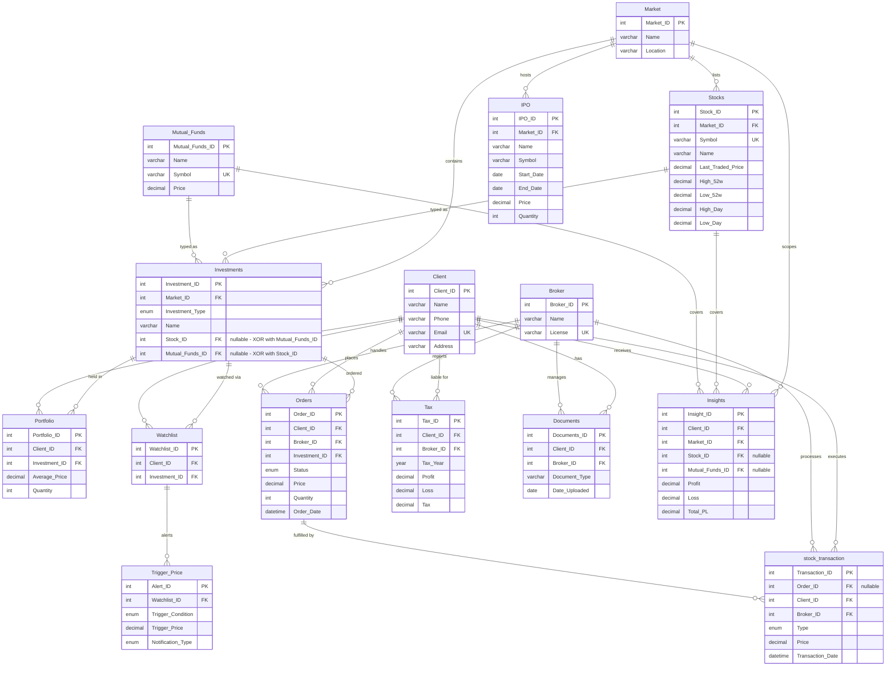

# ER Diagram — Portfolio Management System

## Notes

- **Investments XOR constraint:** exactly one of `Stock_ID` / `Mutual_Funds_ID` must be non-null (`chk_inv_exclusive`). Mermaid shows both FK lines; the constraint is enforced at the DB level.
- **`stock_transaction.Order_ID` is nullable:** a transaction may exist without a linked order (manual trade). The line shown is `Orders ||--o{ stock_transaction` — zero-or-more transactions per order.
- **`Insights.Stock_ID` / `Mutual_Funds_ID` are nullable:** an insight may be market-level only.
- **`stock_transaction`** is named to avoid the MySQL reserved word `TRANSACTION`.
